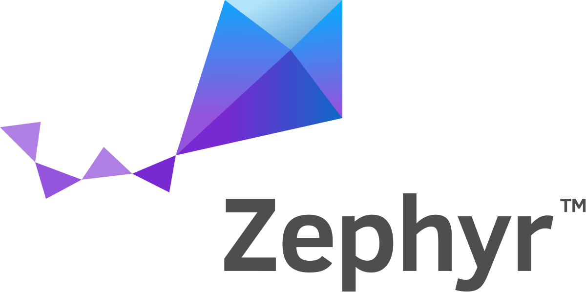

<br/>

<a>
   <p align="center">
      
      
   </p>
</a>
<br/>

# micro-ROS module for Zephyr

This module has been tested in Zephyr RTOS v2.4.0 (SDK 0.11.4), v2.5.0 (SDK 0.11.4) and v2.6.0 (SDK 0.12.4).

## Dependencies

This component needs `colcon` and other Python 3 packages in order to build micro-ROS packages:

```bash
pip3 install catkin_pkg lark-parser empy colcon-common-extensions
```

## Usage

For example for `disco_l475_iot1` board:

```bash
west build -b disco_l475_iot1 micro_ros_zephyr_module
```

Some configuration parameters can be found using:

```bash
west build -t menuconfig
# Modules -> micro-ROS support
```

Is possible to use a micro-ROS Agent just with this docker command:

```bash
# Serial micro-ROS Agent
docker run -it --rm -v /dev:/dev --privileged --net=host microros/micro-ros-agent:foxy serial --dev [YOUR BOARD PORT] -v6

# UDPv4 micro-ROS Agent
docker run -it --rm --net=host microros/micro-ros-agent:foxy udp4 --port 8888 -v6

```

## Purpose of the Project

This software is not ready for production use. It has neither been developed nor
tested for a specific use case. However, the license conditions of the
applicable Open Source licenses allow you to adapt the software to your needs.
Before using it in a safety relevant setting, make sure that the software
fulfills your requirements and adjust it according to any applicable safety
standards, e.g., ISO 26262.

## License

This repository is open-sourced under the Apache-2.0 license. See the [LICENSE](LICENSE) file for details.

For a list of other open-source components included in ROS 2 system_modes,
see the file [3rd-party-licenses.txt](3rd-party-licenses.txt).

## Known Issues/Limitations

There are no known limitations.
